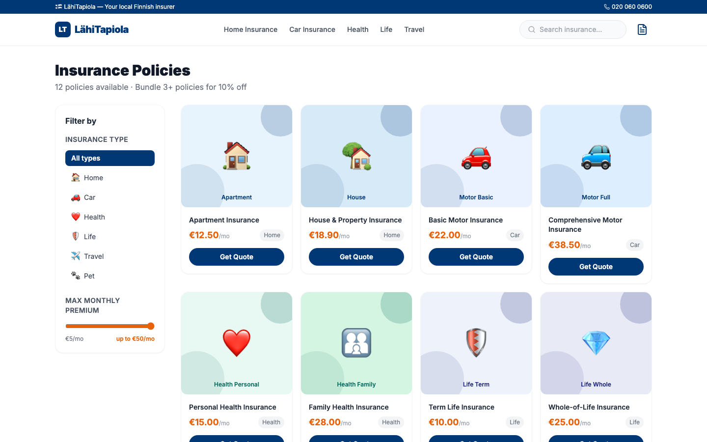
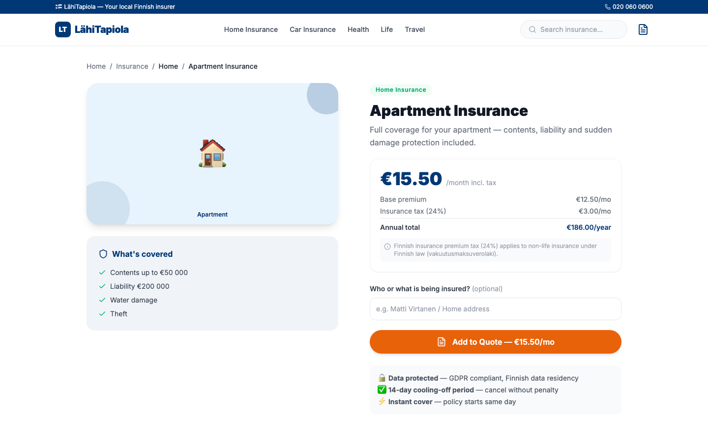
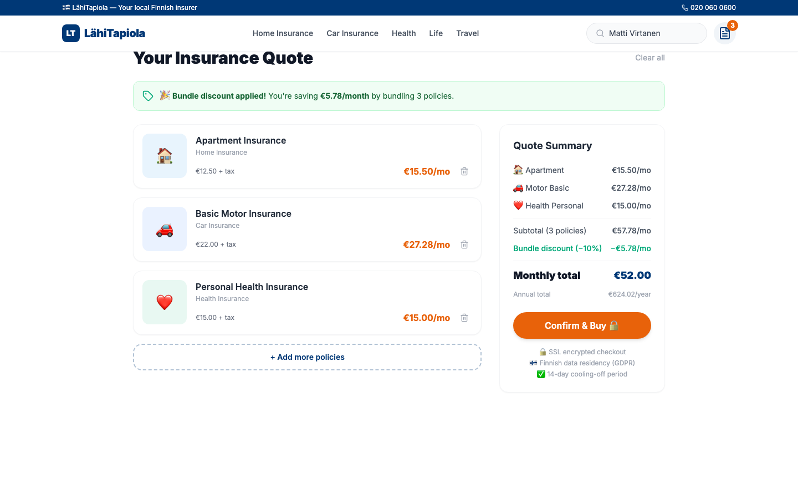

# LähiTapiola Demo App

An insurance buying & quote app built with **Next.js 14**, **TypeScript**, and **Tailwind CSS** — purpose-built to showcase GitHub Copilot to engineering teams. Inspired by Finnish mutual insurance information architecture.

## Screenshots

### Homepage


### Policy Catalogue (`/policies`)


### Policy Detail (`/policies/[id]`)


### Quote Summary (`/quote`)


---

## Tech Stack

| Tool | Version |
|------|---------|
| Next.js | 14 (App Router) |
| TypeScript | 5 |
| Tailwind CSS | 3 |
| State | React Context |
| Testing | Jest + ts-jest |
| CI | GitHub Actions |
| Deploy | Vercel-ready |

## Getting Started

```bash
git clone https://github.com/octodemo/lahitapiola-demo
cd lahitapiola-demo
npm install
npm run dev
```

Open [http://localhost:3000](http://localhost:3000)

```bash
# Run the test suite
npm test
```

## Routes

| Route | Description |
|-------|-------------|
| `/` | Homepage: hero, 6 insurance category tiles, featured policies, bundle CTA |
| `/policies` | Policy catalogue with type filter + max premium slider |
| `/policies/[id]` | Policy detail: Finnish tax breakdown, coverage highlights, add to quote |
| `/quote` | Quote summary: itemised premiums, bundle discount, annual total, confirm |

## Project Structure

```
src/
├── app/
│   ├── page.tsx                    # Homepage
│   ├── policies/
│   │   ├── page.tsx                # Policy catalogue (browse + filter)
│   │   └── [id]/page.tsx           # Policy detail + add-to-quote
│   └── quote/
│       └── page.tsx                # Quote summary + bundle discount
├── components/
│   ├── Navbar.tsx                  # LähiTapiola nav + quote counter badge
│   ├── Footer.tsx
│   └── PolicyCard.tsx              # Policy card used in grid + detail
├── context/
│   └── QuoteContext.tsx            # ← Quote state + bundle discount logic
└── data/
    └── policies.ts                 # ← 12 insurance products + Finnish tax calc

__tests__/
├── premiumCalculator.test.ts       # Finnish VAT logic (16 tests)
└── discount.test.ts                # Bundle discount logic (9 tests)

.github/
└── workflows/ci.yml                # Runs tests + lint on every PR
```

---

## 3 Copilot Demo Moments

### Moment 1 — Codebase Understanding & Change Impact

Open `src/data/policies.ts` and ask Copilot in agent mode:

> *"If I change `monthlyPremium` from a flat `number` to an object `{ base: number, addons: number[] }`, what files would be affected and what would need to change in each?"*

Copilot traces the full dependency chain across 5 files:
`policies.ts` → `PolicyCard.tsx` → `policies/[id]/page.tsx` → `QuoteContext.tsx` → `quote/page.tsx`

See [`DEMO.md`](DEMO.md) for the full script and talking points.

---

### Moment 2 — Implement Feature + Write Tests

Find the `TODO` comment in `src/app/quote/page.tsx` and ask Copilot:

> *"Add a 'Bundle discount' line item row to the quote breakdown table — show when `bundleDiscountActive` is true, display the percentage, and style the saving in green."*

Then: *"Now write tests for the bundle discount logic."*

---

### Moment 3 — Agentic Triage Loop

**Bug PR ready at [pull/2](https://github.com/octodemo/lahitapiola-demo/pull/2)**

The `vat-bug` branch applies a flat 20% tax to all policies. Finnish law requires 24% for non-life and 0% for life/health — so `npm test` fails on the PR.

Demo flow: open the PR → CI shows ❌ → assign to Copilot agent → agent reads the failure, fixes `getInsuranceTaxRate()`, pushes → CI goes ✅.

---

## Safety Net

```bash
# Reset any file to the clean main state
git checkout -- src/data/policies.ts

# Confirm all 25 tests pass
npm test
```

---

## Deploy

[](https://vercel.com/new/clone?repository-url=https://github.com/octodemo/lahitapiola-demo)

> **Note:** This is a demo app built for GitHub Copilot showcases. All data is fictional. Not affiliated with LähiTapiola Group Oyj.
