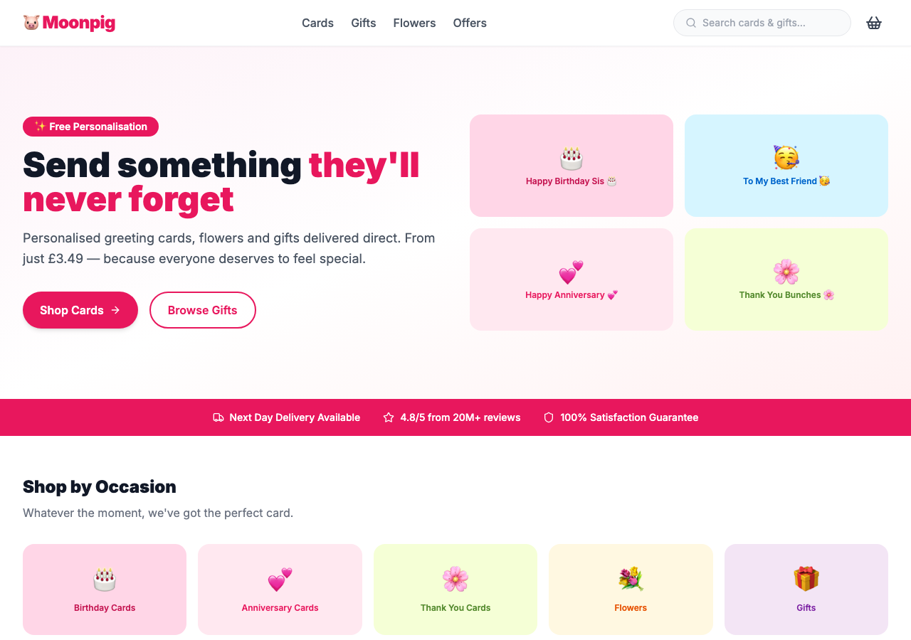
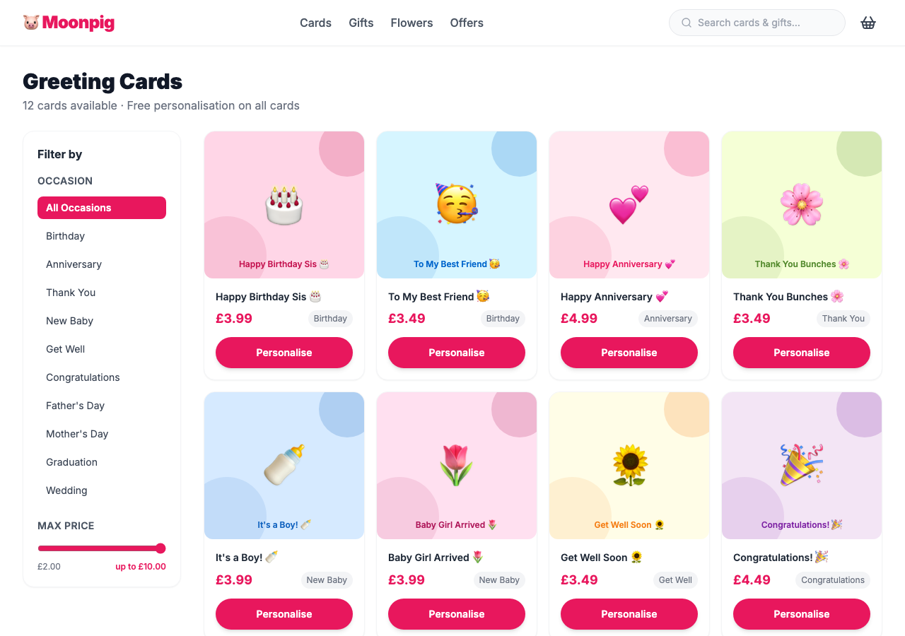
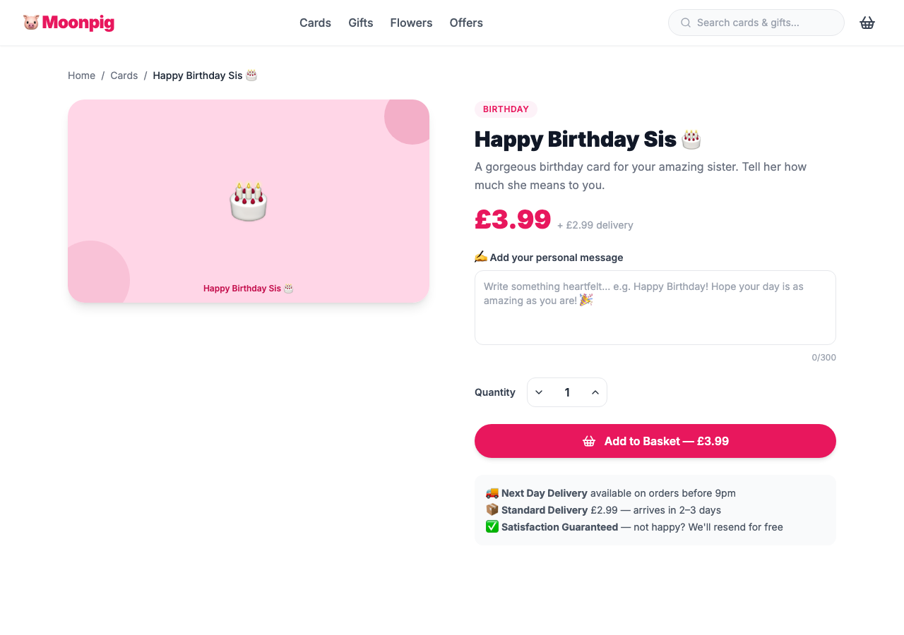
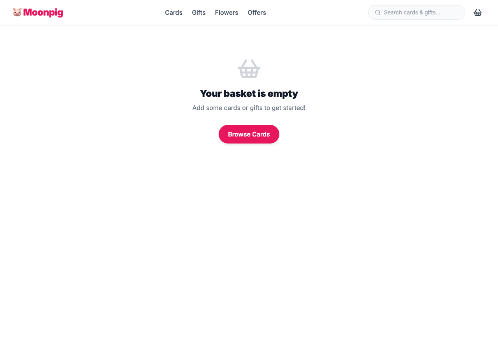

# 🐷 Moonpig Demo App

A Moonpig-inspired greeting card & gifts e-commerce app built with **Next.js 14**, **TypeScript**, and **Tailwind CSS**. Built specifically to demo GitHub Copilot features to engineering teams.

## Screenshots

### Homepage


### Cards Listing (`/cards`)


### Card Personalise (`/cards/[id]`)


### Basket (`/basket`)


---

## Tech Stack

| Tool | Version |
|------|---------|
| Next.js | 14 (App Router) |
| TypeScript | 5 |
| Tailwind CSS | 3 |
| State | React Context |
| Backend | None — mock data |
| Deploy | Vercel-ready |

## Getting Started

```bash
git clone https://github.com/octodemo/moonpig-demo
cd moonpig-demo
npm install
npm run dev
```

Open [http://localhost:3000](http://localhost:3000)

## Pages

| Route | Description |
|-------|-------------|
| `/` | Homepage: hero, category grid, trending cards |
| `/cards` | Card listing with occasion + price filters |
| `/cards/[id]` | Card detail, personalise with live preview |
| `/basket` | Basket, quantities, order summary |

## Project Structure

```
src/
├── app/
│   ├── page.tsx              # Homepage
│   ├── cards/
│   │   ├── page.tsx          # Cards listing
│   │   └── [id]/page.tsx     # Card detail + personalise
│   └── basket/
│       └── page.tsx          # Basket
├── components/
│   ├── Navbar.tsx
│   ├── Footer.tsx
│   └── CardImage.tsx
├── context/
│   └── BasketContext.tsx      # Basket state (React Context)
└── data/
    └── cards.ts              # ← Mock card data, expand here!
```

## Demo Copilot Hooks

Two TODOs pre-planted for live Copilot demos:

```tsx
// src/app/cards/[id]/page.tsx
// TODO: Add Copilot-suggested add-ons (e.g. gift wrap, balloon)

// src/app/basket/page.tsx
// TODO: Add promo code field
```

See [`DEMO.md`](DEMO.md) for the full demo script.

## Safety Net

A `demo-backup` branch contains both features pre-implemented, in case live coding doesn't go to plan.

```bash
git checkout demo-backup
```

## Deploy

[](https://vercel.com/new/clone?repository-url=https://github.com/octodemo/moonpig-demo)
